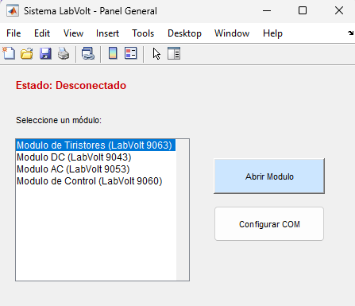
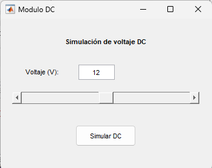
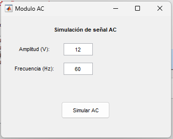
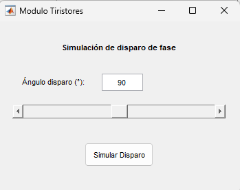
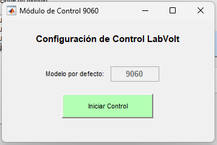

# Estructura del código
El archivo principal contiene varias funciones:

## GUI_Principal
Es la ventana principal del sistema:
- **Muestra** el estado de conexión.
- **Permite** seleccionar módulos LabVolt:
  - Tiristores (9063)
  - DC (9043)
  - AC (9053)
  - Control (9060)
- **Incluye** botón de configuración de puerto COM (simulado).
- **Permite** abrir interfaces secundarias.

## Configuración de comunicación
`function configurar_com(~,~)`
- Solicita el puerto COM.
- Simula una conexión exitosa.
- Cambia el estado visual a "Conectado".
> *Nota: Esta parte está preparada para ser reemplazada por la comunicación real con la DLL.*

## Apertura de módulos y evidencia del funcionamiento
A continuación se muestran capturas del sistema en ejecución
`function abrir_modulo(~,~)`
Dependiendo del módulo seleccionado, abre una ventana específica:
- GUI_Tiristores()
- GUI_DC()
- GUI_AC()
- GUI_Control()
- 

*(Panel principal)*

## Módulos implementados

### Módulo DC
Permite ajustar voltaje mediante campo de texto o slider y simular salida DC.

*(Módulo DC)*

### Módulo AC
Permite configurar amplitud y frecuencia para simular señal AC.

*(Módulo AC)*

### Módulo de Tiristores
Permite ajustar ángulo de disparo (0° – 180°) y simular comportamiento de fase.

*(Módulo Tiristores)*

### Módulo de Control (9060)
Permite visualizar el modelo e iniciar el sistema de control (simulado).

*(Módulo de control)* 

## Archivos utilizados
Todos los archivos necesarios ya se encuentran cargados en el repositorio:
- Código MATLAB de la interfaz.
- Funciones auxiliares.
- Base para integración con DLL.
