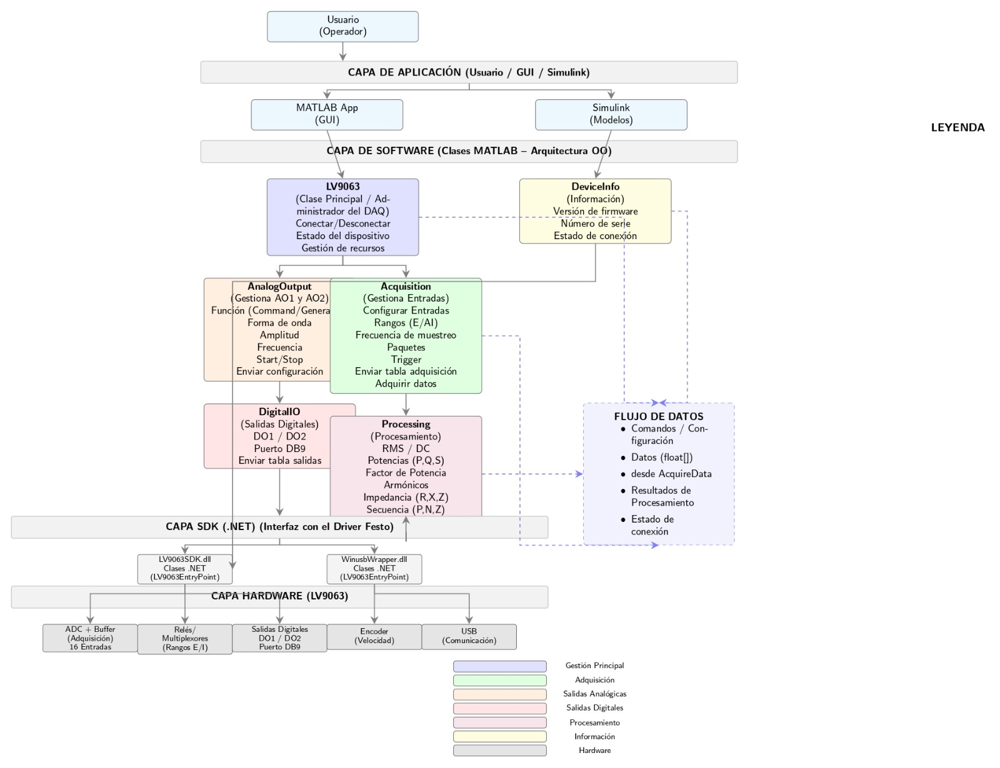
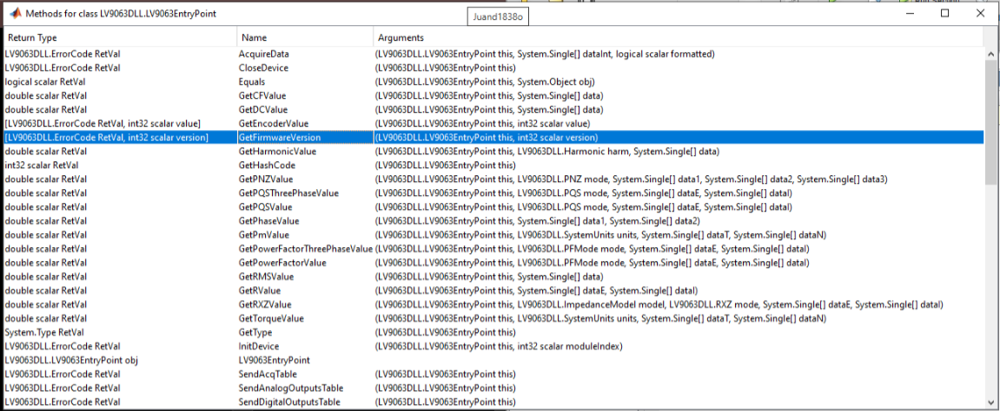

# Arquitectura del Sistema y Referencias de la clase

Para garantizar la modularidad y el correcto procesamiento de los datos, el proyecto se diseñó bajo una **Arquitectura Orientada a Objetos (OO)** estructurada en 4 capas dinámicas. Esto permite aislar la interfaz gráfica de la complejidad de las librerías de bajo nivel del fabricante.



### Descripción de las Capas:

1. **Capa de Aplicación (Usuario / GUI / Simulink):** Interfaces gráficas (MATLAB App) y modelos de simulación que interactúan directamente con el operador de forma intuitiva.
2. **Capa de Software (Clases MATLAB):** Núcleo lógico del proyecto que abstrae las funciones del SDK en componentes especializados:
   * **`LV9063`:** Clase principal encargada de la conexión y gestión del hardware.
   * **`AnalogOutput` & `Acquisition`:** Controladores de configuración de señales de entrada (lecturas, triggers, muestreo) y salida (amplitud, frecuencia).
   * **`Processing`:** Módulo matemático que calcula en tiempo real variables críticas como valores RMS, potencias (P, Q, S), armónicos e impedancias.
3. **Capa SDK (.NET):** El puente de comunicación que traduce las órdenes de MATLAB hacia el driver mediante las bibliotecas `LV9063SDK.dll` y `WinusbWrapper.dll`.
4. **Capa Hardware (LV9063):** El módulo físico de Festo Labvolt (entradas analógicas, relés, salidas digitales, encoder y puerto USB).


# LV9063EntryPoint



## 1. ¿Qué es esta clase?

La clase **LV9063EntryPoint** pertenece al SDK (Software Development Kit) proporcionado por el fabricante **Festo/LabVolt** (licencia **9069-90**) y es la encargada de establecer la comunicación entre el software y el dispositivo de adquisición de datos **LV9063 (DAQ)**.

En otras palabras, esta clase actúa como un intermediario entre el hardware y la aplicación desarrollada en MATLAB.

La comunicación puede representarse de la siguiente manera:

```text
SDK (.NET)
│
├── LV9063SDK.dll
└── WinusbWrapper.dll
        │
        ▼
LV9063EntryPoint
        │
        ▼
Aplicación desarrollada en MATLAB
(LV9063, DeviceInfo, AnalogOutput,
Acquisition, DigitalIO y Processing)
```

Desde MATLAB, esta clase se utiliza mediante la interoperabilidad con **.NET**, agregando previamente el ensamblado mediante `NET.addAssembly`. Una vez cargado, es posible crear una instancia de la clase y acceder a sus métodos como si fueran objetos propios de MATLAB.

Por esta razón, las clases desarrolladas en MATLAB (**LV9063**, **DeviceInfo**, **AnalogOutput**, **Acquisition**, **DigitalIO** y **Processing**) no interactúan directamente con el hardware. En realidad, funcionan como **wrappers** (envoltorios) que organizan y simplifican el acceso a los métodos de **LV9063EntryPoint**, proporcionando una interfaz más clara y fácil de utilizar.

---

# 2. Agrupación funcional de los métodos

Aunque el SDK proporciona una única clase con numerosos métodos, para facilitar el diseño de la aplicación estos se agrupan según la función que desempeñan. Esta organización coincide con la arquitectura orientada a objetos implementada en MATLAB, donde cada clase se encarga de una responsabilidad específica.

---

## A. Gestión del dispositivo → Clase `LV9063`

Esta clase concentra todas las funciones relacionadas con la inicialización y administración de la comunicación con el dispositivo DAQ.

| Método | Argumentos | Retorna | Descripción |
|---------|------------|----------|-------------|
| **LV9063EntryPoint** | — | Objeto `LV9063EntryPoint` | Constructor de la clase. Crea la instancia que representa la conexión lógica con el DAQ. Es el primer objeto que debe instanciarse en MATLAB. |
| **InitDevice** | `this` | `ErrorCode` | Inicializa y abre la comunicación USB con el hardware. Debe ejecutarse antes de cualquier otra operación. |
| **CloseDevice** | `this` | `ErrorCode` | Cierra la comunicación con el dispositivo y libera los recursos utilizados. Se recomienda ejecutarlo al finalizar el programa o al eliminar el objeto. |
| **Equals** | `this`, `obj` | `logical` | Método heredado de `System.Object`. Compara si dos referencias apuntan al mismo objeto .NET. |
| **GetHashCode** | `this` | `int32` | Devuelve un identificador interno del objeto. Es un método propio de .NET. |
| **GetType** | `this` | `System.Type` | Devuelve el tipo del objeto durante la ejecución. Se utiliza principalmente para depuración. |

> **Nota:** Los métodos `Equals`, `GetHashCode` y `GetType` pertenecen a la clase base de .NET y no realizan ninguna operación sobre el hardware, por lo que normalmente no se incluyen dentro de la API desarrollada en MATLAB.

---

## B. Información del dispositivo → Clase `DeviceInfo`

Esta clase agrupa los métodos utilizados para consultar información general del dispositivo.

| Método | Argumentos | Retorna | Descripción |
|---------|------------|----------|-------------|
| **GetFirmwareVersion** | `this`, `int32 version` (salida) | `[ErrorCode, int32 version]` | Obtiene la versión del firmware instalada en el dispositivo DAQ. En MATLAB el segundo argumento se recibe como un valor de salida. |

> **Observación:** Información adicional como el número de serie o el estado de conexión puede encontrarse en otras clases del mismo ensamblado (`LV9063DLL`) y no necesariamente dentro de `LV9063EntryPoint`.

---

## C. Adquisición de datos → Clase `Acquisition`

Esta clase contiene los métodos responsables de configurar y obtener las mediciones provenientes del hardware.

| Método | Argumentos | Retorna | Descripción |
|---------|------------|----------|-------------|
| **AcquireData** | `this`, `dataInt (System.Single[])`, `formatted` | `ErrorCode` | Inicia la adquisición de datos desde las entradas analógicas del DAQ. El arreglo `dataInt` almacena las muestras obtenidas. El parámetro `formatted` indica si los datos se entregan en formato bruto o escalado. |
| **GetEncoderValue** | `this`, `int32 value` (salida) | `[ErrorCode, int32 value]` | Obtiene el valor actual del encoder conectado al dispositivo. |
| **SendAcqTable** | `this` | `ErrorCode` | Envía al DAQ la configuración previamente definida para la adquisición (frecuencia de muestreo, rangos, trigger, etc.). |

---

## D. Salidas analógicas → Clase `AnalogOutput`

Esta clase administra las salidas analógicas disponibles en el dispositivo.

| Método | Argumentos | Retorna | Descripción |
|---------|------------|----------|-------------|
| **SendAnalogOutputsTable** | `this` | `ErrorCode` | Envía al hardware la configuración y los valores de las salidas analógicas AO1 y AO2, incluyendo parámetros como amplitud, frecuencia y forma de onda. |

---

## E. Salidas digitales → Clase `DigitalIO`

Esta clase controla las salidas digitales del DAQ.

| Método | Argumentos | Retorna | Descripción |
|---------|------------|----------|-------------|
| **SendDigitalOutputsTable** | `this` | `ErrorCode` | Envía al hardware el estado de las salidas digitales DO1 y DO2. |

---

## F. Procesamiento de señales → Clase `Processing`

A diferencia de las clases anteriores, estos métodos no interactúan directamente con el hardware. Su función consiste en procesar los datos adquiridos para obtener diferentes parámetros eléctricos y mecánicos.

| Método | Argumentos | Retorna | Descripción |
|---------|------------|----------|-------------|
| **GetRMSValue** | `this`, `data (Single[])` | `double` | Calcula el valor eficaz (RMS) de una señal. |
| **GetDCValue** | `this`, `data` | `double` | Calcula el valor promedio o componente DC de una señal. |
| **GetCFValue** | `this`, `data` | `double` | Calcula el Crest Factor (relación entre el valor pico y el valor RMS). |
| **GetRValue** | `this`, `data` | `double` | Calcula la resistencia eléctrica a partir de los datos adquiridos. |
| **GetPhaseValue** | `this`, `data1`, `data2` | `double` | Calcula el ángulo de fase entre dos señales. |
| **GetHarmonicValue** | `this`, `Harmonic harm`, `data` | `double` | Obtiene la magnitud de un armónico específico de la señal. |
| **GetPNZValue** | `this`, `PNZ mode`, `data1`, `data2`, `data3` | `double` | Calcula las componentes de secuencia positiva, negativa o cero en sistemas trifásicos. |
| **GetPQSValue** | `this`, `PQS mode`, `dataE`, `dataI` | `double` | Calcula la potencia activa (P), reactiva (Q) o aparente (S) en sistemas monofásicos. |
| **GetPQSThreePhaseValue** | `this`, `PQS mode`, `dataE`, `dataI` | `double` | Calcula la potencia activa, reactiva o aparente en sistemas trifásicos. |
| **GetPowerFactorValue** | `this`, `PFMode mode`, `dataE`, `dataI` | `double` | Calcula el factor de potencia monofásico. |
| **GetPowerFactorThreePhaseValue** | `this`, `PFMode mode`, `dataE`, `dataI` | `double` | Calcula el factor de potencia trifásico. |
| **GetRXZValue** | `this`, `dataE`, `dataI` | `double` | Calcula resistencia, reactancia o impedancia del sistema. |
| **GetTorqueValue** *(Sobrecarga 1)* | `this`, `ImpedanceModel model`, `RXZ mode`, `dataE`, `dataI` | `double` | Calcula el torque utilizando un modelo de impedancia eléctrica. |
| **GetTorqueValue** *(Sobrecarga 2)* | `this`, `SystemUnits units`, `dataT`, `dataN` | `double` | Calcula el torque a partir de datos mecánicos utilizando el sistema de unidades especificado. |
| **GetPmValue** | `this`, `SystemUnits units`, `dataT`, `dataN` | `double` | Calcula la potencia mecánica a partir del torque y la velocidad angular. |

> **Nota:** `GetTorqueValue` posee dos sobrecargas. MATLAB selecciona automáticamente cuál utilizar dependiendo del número y tipo de argumentos enviados.

---

# 3. Tipos de retorno importantes

Los métodos del SDK utilizan diferentes tipos de datos propios de .NET. Comprenderlos facilita la integración entre MATLAB y el dispositivo DAQ.

| Tipo | Significado |
|------|-------------|
| **LV9063DLL.ErrorCode** | Enumeración que indica si la operación se ejecutó correctamente o si ocurrió algún error (por ejemplo, dispositivo desconectado o tiempo de espera agotado). Se recomienda verificar este valor después de cada llamada al SDK. |
| **[ErrorCode, valor]** | Algunas funciones devuelven un código de estado junto con el resultado solicitado. En MATLAB ambos valores se reciben como múltiples salidas, por ejemplo: ` [err, version] = obj.GetFirmwareVersion(0);` |
| **System.Single[]** | Arreglo de números en formato `single` (precisión simple). Es el tipo utilizado para almacenar las muestras adquiridas por el DAQ. |
| **Enums (`PQS`, `PFMode`, `RXZ`, `Harmonic`, `SystemUnits`, `ImpedanceModel`)** | Enumeraciones que representan diferentes modos de operación o tipos de cálculo. En MATLAB se utilizan mediante la sintaxis `LV9063DLL.NombreEnum.Valor`, por ejemplo: `LV9063DLL.PQS.P`. Se recomienda consultar el ensamblado .NET para conocer todos los valores disponibles. |
---
